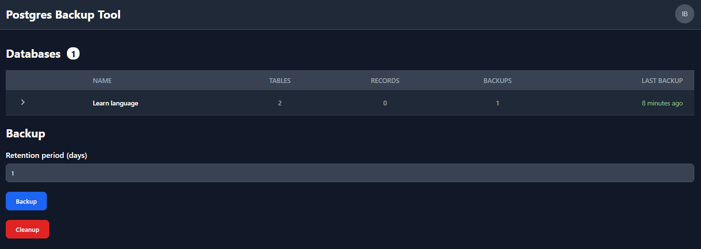
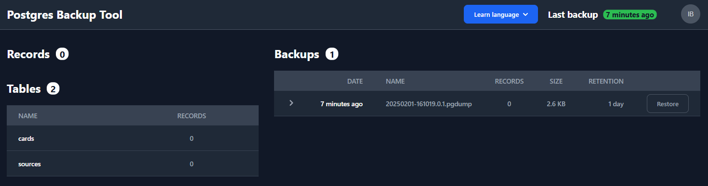

# postgres-azure-backup

Simple PostgreSQL backup tool to Azure with UI




## Features

- Supports multiple databases
- List tables and records of actual database
- Show last backup time
- Creates backups with retention period
- Based on `pg_dump` and `pg_restore` official PostgreSQL utilities
- Persists dumps in Azure Blob Storage
- Cleanup expired backups
- Restore backups
- Exclude tables from backup
- Built-in scheduled backups (daily, weekly, monthly) using Spring @Scheduled
- Smart backup with automatic retention management (daily/7-day, weekly/30-day, monthly/356-day)
- Folder backup support - package database dumps with files from local file system folders in unified ZIP archives
- Can be used without UI as REST API for manual/external triggers
- Fully covered with E2E Selenium tests
- Compatible with PostgreSQL 16
- Secured with Microsoft Entra ID
- Azure cloud-native application

## Stack

- Java 21
- Spring Boot 4, compiled ahead of time into a GraalVM native image
- Angular
- OpenID Connect (`angular-auth-oidc-client`)
- Azure
- PostgreSQL 18 client
- Podman (rootless containers + Kubernetes-style pod manifests)

### One image per Spring profile

The server is shipped as a GraalVM native executable. Bean definitions are
resolved during ahead-of-time processing at build time, so the active Spring
profile is baked into the executable and cannot be chosen at startup any more.
The server image is therefore built once per profile, via the `SPRING_PROFILE`
build argument:

```bash
podman build --build-arg SPRING_PROFILE=test -t postgres-azure-backup-server:test server   # e2e pod
podman build --build-arg SPRING_PROFILE=prod -t postgres-azure-backup-server:prod server   # published image
```

`SPRING_PROFILES_ACTIVE` is not read at runtime; the pipeline builds the test
image for the e2e job and the prod image when publishing to Docker Hub.

## Local development

Local end-to-end environment is orchestrated by Podman using a
Kubernetes-style pod manifest at [`test/test-pod.yaml`](test/test-pod.yaml).
The skeleton patterns (image naming, pod manifest layout, Traefik
gateway, mock OIDC provider) follow
[mucsi96/skeleton-app](https://github.com/mucsi96/skeleton-app).

```bash
# Build images and start the test pod
scripts/pod_up.sh

# Stop and clean up the test pod
scripts/pod_down.sh
```

## Port Mapping

All host-bound ports used by the project live in the **8160–8169** range
(i.e. `xx60–xx69`). local container ports inside the pod also use
this range so that the same numbers work both inside the pod and from
the host.

| Port  | Service              | Notes                                                    |
| ----- | -------------------- | -------------------------------------------------------- |
| 8160  | Traefik web entry    | Application entry point — UI + `/api` reverse-proxy      |
| 8161  | Traefik dashboard    | Traefik admin/ping endpoint                              |
| 8162  | Server actuator      | Spring Boot management port (`/actuator/health/...`)     |
| 8163  | Azurite blob storage | Azure Blob Storage emulator                              |
| 8164  | PostgreSQL `db1`     | First test database                                      |
| 8165  | PostgreSQL `db2`     | Second test database                                     |
| 8166  | Mock OAuth2          | `mucsi96/mock-oidc-provider` — issues JWTs in test mode  |
| 8168  | Server (Spring Boot) | Local port served by the server container                |

When running tests or accessing the application from a browser on the
host, only **8160–8166** are exposed.

## Required environment variables

- `AZURE_CLIENT_ID`
- `AZURE_TENANT_ID`
- `SPRING_ACTUATOR_PORT`
- `STORAGE_ACCOUNT_BLOB_URL`
- `STORAGE_ACCOUNT_CONTAINER_NAME`
- `UI_CLIENT_ID`

## Optional environment variables for backup scheduling

- `BACKUP_SCHEDULE_ENABLED` - Enable/disable scheduled backups (default: `true`)
- `BACKUP_DAILY_CRON` - Cron expression for daily backups (default: `0 30 6 2-31 * MON-SAT`)
- `BACKUP_WEEKLY_CRON` - Cron expression for weekly backups (default: `0 30 6 * * SUN`)
- `BACKUP_MONTHLY_CRON` - Cron expression for monthly backups (default: `0 30 6 1 * *`)
- `BACKUP_CLEANUP_CRON` - Cron expression for cleanup (default: `0 0 7 * * *`)

## Database configuration

In production, the database configuration is stored as the `dbs-config` secret in Azure Key Vault and loaded automatically via Spring Cloud Azure. The secret value is a JSON array:

```json
[
  {
    "name": "db1",
    "host": "db1",
    "port": 5432,
    "database": "test",
    "schema": "test1",
    "username": "postgres",
    "password": "postgres",
    "excludeTables": ["passwords", "secrets"],
    "dumpFormat": "custom",
    "createPlainDump": true,
    "folderBackups": [
      {
        "path": "/var/lib/app/uploads"
      }
    ]
  },
  {
    "name": "db2",
    "host": "db2",
    "port": 5432,
    "database": "test",
    "schema": "test2",
    "username": "postgres",
    "password": "postgres",
    "excludeTables": ["passwords", "secrets"],
    "dumpFormat": "tar"
  }
]
```

### Folder Backup Configuration (Optional)

Add a `folderBackups` array to include files from local file system folders in backups. When configured, backups are created as ZIP archives containing both the database dump and all files from specified local directories.

**Configuration:**
- `path` (required): Absolute path to the local folder to backup (all files within this folder will be included recursively)

**Example - backup multiple folders:**
```json
"folderBackups": [
  {
    "path": "/var/lib/app/uploads"
  },
  {
    "path": "/var/lib/app/documents"
  }
]
```

**Backup structure:**
```
backup.zip
├── database.pgdump
├── database.sql (optional)
└── folders/
    └── /var/lib/app/uploads/
        └── user123/
            └── avatar.jpg
```

## Dump formats

- `custom` (default) - Output a custom-format archive suitable for input into pg_restore. Together with the directory output format, this is the most flexible output format in that it allows manual selection and reordering of archived items during restore. This format is also compressed by default.
- `directory` - Output a directory-format archive suitable for input into pg_restore. This will create a directory with one file for each table and large object being dumped, plus a so-called Table of Contents file describing the dumped objects in a machine-readable format that pg_restore can read. A directory format archive can be manipulated with standard Unix tools; for example, files in an uncompressed archive can be compressed with the gzip, lz4, or zstd tools. This format is compressed by default using gzip and also supports parallel dumps.
- `tar` - Output a tar-format archive suitable for input into pg_restore. The tar format is compatible with the directory format: extracting a tar-format archive produces a valid directory-format archive. However, the tar format does not support compression. Also, when using tar format the relative order of table data items cannot be changed during restore.

## Smart Backup

Smart backup (`POST /api/smart-backup`) intelligently determines which backups are needed based on existing backups and elapsed time. It analyzes backup history and creates only necessary backups with appropriate retention periods.

**How it works:**
1. Checks time since last backup for each retention tier (daily/weekly/monthly)
2. Creates backups only when the interval has elapsed:
   - **Daily**: If 1+ days passed since last daily/weekly/monthly backup → create 7-day retention backup
   - **Weekly**: If 7+ days passed since last weekly/monthly backup → create 30-day retention backup
   - **Monthly**: If 30+ days passed since last monthly backup → create 356-day retention backup
3. Higher retention backups satisfy lower retention requirements (e.g., a monthly backup also counts as a weekly backup)
4. Performs cleanup of expired backups after creating new ones

**Example:** If a monthly backup was created 5 days ago, smart backup will skip daily and weekly backups since the monthly backup satisfies those requirements.

## Scheduled Backups

The application includes built-in scheduled backups with the following default schedule:

- **Daily backups**: Run at 06:30 every day (except Sunday and 1st of month) with 7-day retention
- **Weekly backups**: Run at 06:30 every Sunday with 30-day retention
- **Monthly backups**: Run at 06:30 on the 1st of every month with 356-day retention
- **Cleanup**: Run at 07:00 daily to remove expired backups

Scheduling can be disabled by setting `BACKUP_SCHEDULE_ENABLED=false` or customized using the cron environment variables.

## Deployment with Helm

```bash
hostname=$(az keyvault secret show --vault-name p07-backup --name hostname --query value --output tsv)
apiClientId=$(az keyvault secret show --vault-name p07-backup --name api-client-id --query value --output tsv)

helm repo add mucsi96 https://mucsi96.github.io/k8s-helm-charts
helm upgrade postgres-azure-backup-server mucsi96/spring-app \
    --install \
    --namespace backup \
    --set image=mucsi96/postgres-azure-backup-server:latest \
    --set entryPoint=web \
    --set host=$hostname \
    --set basePath=/api \
    --set clientId=$apiClientId \
    --set serviceAccountName=postgres-azure-backup-api-workload-identity \
    --wait
```

## Resources

- https://github.com/kananindzya/hello-world-aws-sdk-r2/blob/master/src/main/java/com/example/aws/api/r2/App.java
- https://github.com/esfandiar/vs-code-spring-boot-setup
- https://gist.github.com/valferon/4d6ebfa8a7f3d4e84085183609d10f14
- https://cwienczek.com/2020/06/simple-backup-of-postgres-database-in-kubernetes/
- https://developers.cloudflare.com/r2/examples/aws/boto3/
- https://boto3.amazonaws.com/v1/documentation/api/latest/reference/services/s3.html
- https://florianbuchner.com/kubernetes-curl-cronjob-for-internal-service/

- https://flowbite.com/docs/components/tables/
- https://hslpicker.com/
- https://learn.microsoft.com/en-us/azure/developer/java/spring-framework/spring-security-support?tabs=SpringCloudAzure5x#accessing-a-resource-server

- https://github.com/Azure/azure-sdk-for-java/tree/main/sdk/spring/spring-cloud-azure-core/src/main/java/com/azure/spring/cloud/core/resource
